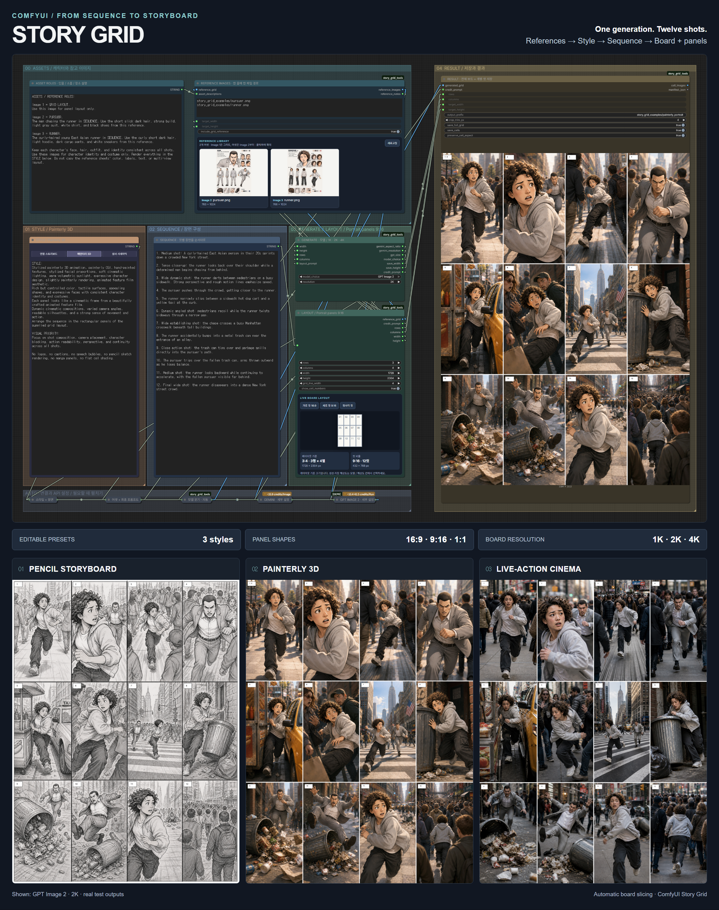
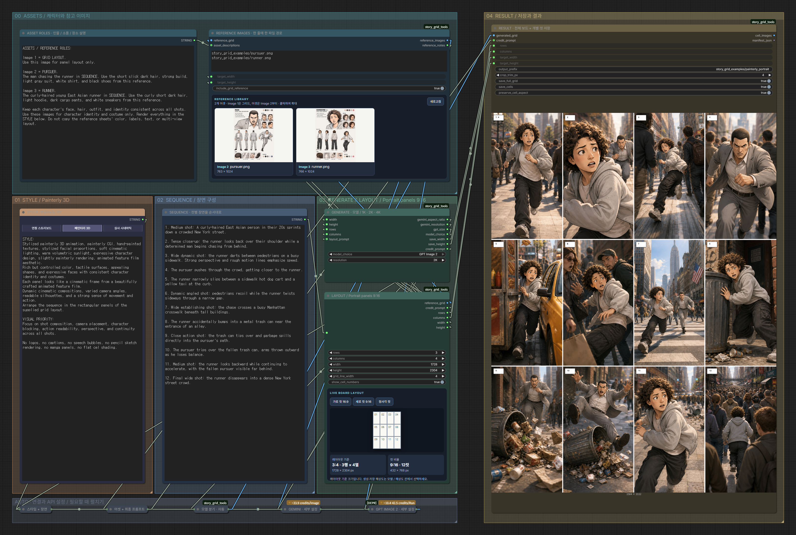
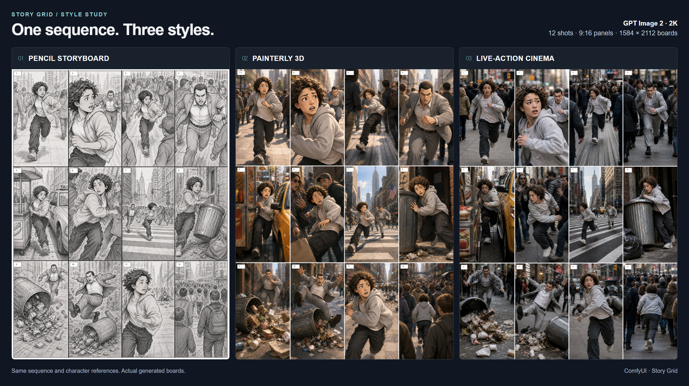
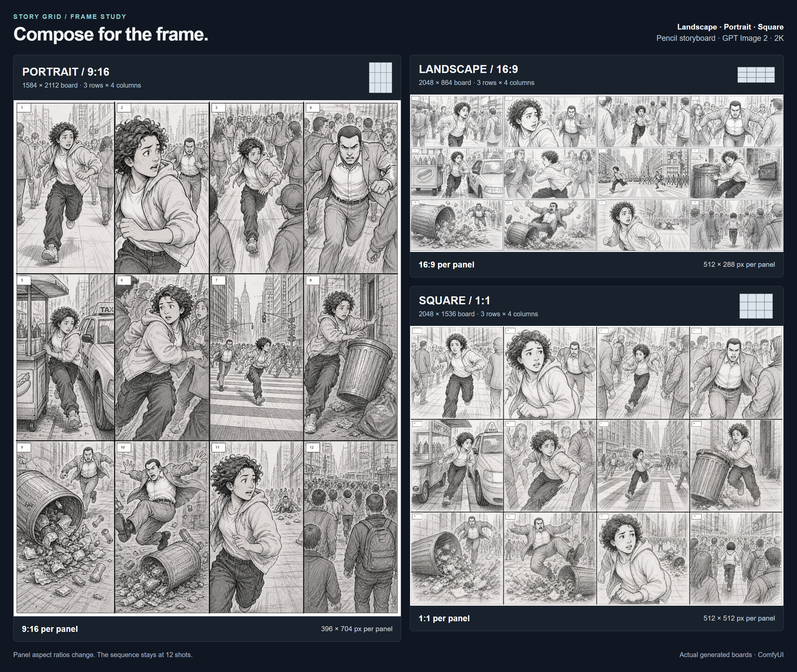

# Story Grid · ComfyUI

[한국어](README.md) · English



**A ComfyUI workflow that turns references, a visual style, and a shot sequence into one storyboard sheet, then saves every panel automatically.**

Generate several shots on one board to reduce repeated API calls and credit overhead while composing character, location, and action continuity together. Review the whole sequence at a glance for early directing ideas and brainstorming. The board and individual panels are saved automatically, so there is no separate pass to cut every shot out in an image editor.

## The workflow



[Landscape workflow capture](docs/images/workflow-landscape.png) · [Square workflow capture](docs/images/workflow-square.png)

| Area | What you do |
| --- | --- |
| **00 ASSETS** | Preview references and describe each image's character, costume, or prop role. |
| **01 STYLE** | Choose pencil storyboard, painterly 3D, or live-action cinematic, then freely edit the prompt. |
| **02 SEQUENCE** | Write numbered shots with their actions and camera compositions. |
| **03 GENERATE & LAYOUT** | Choose the model, 1K/2K/4K, rows, columns, and panel ratio with a live grid preview. |
| **04 RESULT** | Save the full board, individual panels, and a manifest describing generation and crops. |

Switch between **Gemini Pro and GPT Image 2** in the same workflow. The model switch uses lazy inputs, so only the selected model's generation branch executes.

## Three styles, with editable prompts



*Three styles generated from the same 12-shot sequence and character references. All use GPT Image 2, the 2K tier, and 9:16 portrait panels; each board is 1584 × 2112px.*

- **Pencil storyboard:** white paper, rough graphite lines, and minimal shading for reviewing composition and action.
- **Painterly 3D:** hand-painted textures, expressive characters, and soft cinematic lighting.
- **Live-action cinematic:** realistic actors and materials, natural lighting, and the texture of photographed cinema.

Each button fills the existing STYLE text box. Edit it freely after selecting a preset; clicking a preset again replaces the text. Saving the workflow preserves the current edited prompt.

## Landscape, portrait, and square panels



A panel's aspect ratio differs from that of the entire board. These pencil-style examples were generated with **3 rows × 4 columns, 12 panels**, all using GPT Image 2 and the 2K tier.

| Individual panel | Whole-board ratio | Saved board size | Example use |
| --- | --- | --- | --- |
| 16:9 | 64:27 | 2048 × 864px | Landscape video shot planning |
| 9:16 | 3:4 | 1584 × 2112px | Shorts and Reels compositions |
| 1:1 | 4:3 | 2048 × 1536px | Exploring square frames |

The ratio buttons size the board around the **individual panel**. Rows and columns are also adjustable. **1K/2K/4K are resolution tiers for the whole board**; each panel receives a portion of those pixels.

## Install and get started

1. Use a ComfyUI installation with the `GeminiImage2Node` and `OpenAIGPTImage1` API nodes available. Set up the sign-in and credits required by those API nodes.
2. Copy [custom_nodes/story_grid_tools](custom_nodes/story_grid_tools) into `ComfyUI/custom_nodes/story_grid_tools`. Restart ComfyUI and refresh the browser.
3. Copy both images from [examples/references](examples/references) into `ComfyUI/input/story_grid_examples/`.
4. Load the [main model-switch workflow](workflows/story_grid_credit_3x4_refs_switch.json). Check that **00 ASSETS** shows the references below in the correct order.
5. Edit STYLE and SEQUENCE, choose the model, resolution, and grid in **03**, then run the workflow.

| Name used in the prompt | Role | Default path |
| --- | --- | --- |
| **Image 1** | Panel layout only | Generated by the workflow |
| **Image 2** | MAN / PURSUER | `story_grid_examples/pursuer.png` |
| **Image 3** | SOMEONE / RUNNER | `story_grid_examples/runner.png` |

Labels such as `Image 1` describe the attachment order supplied by this workflow. Describe character roles using that order rather than relying on filenames. For your own assets, enter one path per line and update the role descriptions when adding, removing, or reordering images. If the grid reference is disabled, the first asset becomes Image 1.

The starter workflow defaults to **pencil storyboard · 16:9 panels · GPT Image 2 · 2K**.

## Examples and saved output

Load a JSON file in ComfyUI, then replace the reference images and shot sequence.

| Style | Landscape panels 16:9 | Portrait panels 9:16 | Square panels 1:1 |
| --- | --- | --- | --- |
| Pencil storyboard | [JSON](examples/workflows/pencil_landscape.json) | [JSON](examples/workflows/pencil_portrait.json) | [JSON](examples/workflows/pencil_square.json) |
| Painterly 3D | [JSON](examples/workflows/painterly_landscape.json) | [JSON](examples/workflows/painterly_portrait.json) | [JSON](examples/workflows/painterly_square.json) |
| Live-action cinematic | [JSON](examples/workflows/cinematic_landscape.json) | [JSON](examples/workflows/cinematic_portrait.json) | [JSON](examples/workflows/cinematic_square.json) |

There are **five actual generated boards** and **nine configuration templates**. The comparison images arrange those generated boards for easier viewing. They do not include generation comparisons for Gemini, 1K, or 4K.

The default output location is `ComfyUI/output/<output_prefix>/<run timestamp>/`.

```text
generated_grid.png       Full storyboard sheet
cells/grid/
  cell_01_r1_c1.png       First panel
  cell_02_r1_c2.png       Second panel
  ...
manifest.json            Prompt, board dimensions, crop coordinates, and saved files
```

## Observations and practical limits

In this New York chase sequence test, **GPT Image 2 produced the intended storyboards more consistently.** The examples default to GPT Image 2 based on that production experience.

- A combined board does not guarantee consistent character identity, the correct panel count, aligned borders, or continuous action. Cropping follows the configured uniform grid, so inspect the generated borders.
- More panels share the same board resolution, leaving fewer pixels for each shot.
- Supported sizes differ between models. Fitting the board can involve resizing or edge cropping. The current GPT sizing helper fits its 4K tier within a 3840px longest edge and approximately 8.29 million pixels; Gemini uses the nearest supported aspect ratio.
- Credit savings depend on the model, board size, and the individual-shot generation method being compared.

Workflow captures were made with [ComfyUI Workflow Image Export](https://github.com/nomadoor/ComfyUI-Workflow-Image-Export).
